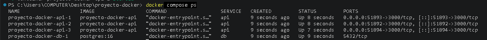
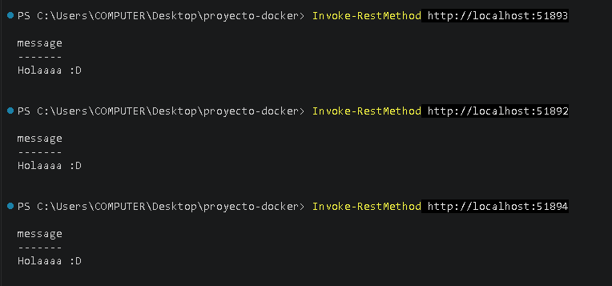

# Ejercicio Docker Compose Lab

Este proyecto usa Docker Compose para levantar 3 copias de una API en Node.js junto con una base de datos PostgreSQL, todo corriendo en contenedores separados.


## Descripción del Proyecto
Este proyecto levanta un entorno completo utilizando Docker Compose, el cual incluye tres instancias independientes de una API desarrollada en Node.js mediante un build local, conectadas de forma segura a una base de datos PostgreSQL con persistencia de datos garantizada.

## Tecnologías Utilizadas
- Docker
- Docker Compose
- Node.js
- PostgreSQL
- Git / GitHub

## Estructura de la Arquitectura
proyecto-docker/
├── api/
│   ├── Dockerfile
│   ├── index.js
│   ├── package.json
│   └── package-lock.json
├── .env
├── .gitignore
├── docker-compose.yml
└── README.md
## Requisitos
- Docker Desktop instalado y en ejecución
- Docker Compose
- Git

## Configuración

1. **Clonar el repositorio:**
```bash
git clone https://github.com/Jere0000/EjercicioLabS2-docker-compose.git
cd EjercicioLabS2-docker-compose
```

2. Crear el archivo `.env` en la raíz con estas variables:
POSTGRES_DB=infraLabS2
POSTGRES_USER=ejem_usuario
POSTGRES_PASSWORD=11223344

## Ejecución

1. Construir e iniciar los servicios:
```bash
docker compose up --build -d
```

2. Ver los contenedores corriendo y sus puertos asignados:
```bash
docker compose ps
```

3. Probar la API en el navegador usando el puerto que te muestre el comando anterior:
```
http://localhost:PUERTO
```
## Detener el proyecto

```bash
docker compose down
```

## Tipos de Redes:

- Bridge: Es una red interna que Docker arma sola para que tus contenedores se hablen entre ellos, sin salir a la red de tu compu directamente.
- Host: El contenedor usa la conexión de red de tu propia PC, no una aislada
- None: Sin red, aislado
- Overlay: Se usa cuando tienes varios servidores/máquinas trabajando juntas, no solo una PC
- Macvlan: Hace que el contenedor parezca un dispositivo físico más conectado a tu router

## Tipos de Volúmenes:

- Volumen nombrado: Es como una carpeta que Docker crea y cuida por ti, identificada con un nombre.
- Bind mount: Conectas una carpeta específica de tu PC al contenedor
- tmpfs: Guarda cosas solo mientras el contenedor está prendido, en la memoria RAM — se pierde todo al apagar

## Capturas del Trabajo

## Contenedores corriendo


## API respondiendo

